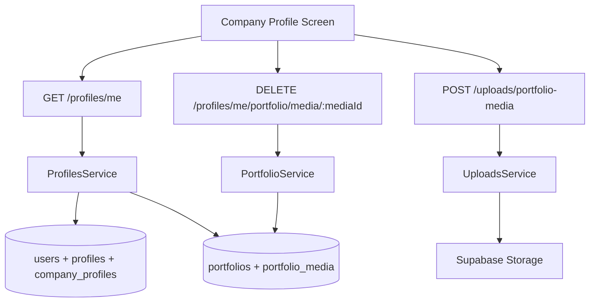

# Company Portfolio Media Design

**Spec**: `backend/.specs/features/company-portfolio-media/spec.md`
**Status**: Approved

---

## Architecture Overview

O portfólio nasce como um módulo transversal do usuário. `profiles`, `company_profiles` e `creator_profiles` continuam como extensões de dados pessoais/específicos de papel, enquanto `portfolio` passa a concentrar a galeria compartilhável por company e creator.



## Code Reuse Analysis

### Existing Components to Leverage

| Component | Location | How to Use |
| --- | --- | --- |
| `ProfilesService` | `backend/src/profiles/profiles.service.ts` | Expandir payload de `getMe` |
| `UploadsService` | `backend/src/uploads/uploads.service.ts` | Reaproveitar integração com Supabase Storage |
| `UploadsController` | `backend/src/uploads/uploads.controller.ts` | Adicionar endpoint de upload de mídia |
| `CompanyProfile` | `backend/src/profiles/entities/company-profile.entity.ts` | Expandir campos do layout |

### Integration Points

| System | Integration Method |
| --- | --- |
| TypeORM | Novas entidades `Portfolio` e `PortfolioMedia` |
| Supabase Storage | Upload de imagens e vídeos do portfólio |
| `GET /profiles/me` | Incluir `portfolio` no payload autenticado |

## Components

### Portfolio Entity Layer

- **Purpose**: Persistir um portfólio único por usuário e N mídias ordenadas.
- **Location**: `backend/src/portfolio/entities/`
- **Interfaces**:
  - `Portfolio.userId: string`
  - `PortfolioMedia.type: IMAGE | VIDEO`
  - `PortfolioMedia.status: PROCESSING | READY | FAILED`
- **Dependencies**: TypeORM, `User`
- **Reuses**: Padrão de entidades do módulo `profiles`

### PortfolioService

- **Purpose**: Garantir criação lazy do portfólio, listar mídias por usuário e remover mídias com checagem de ownership.
- **Location**: `backend/src/portfolio/portfolio.service.ts`
- **Interfaces**:
  - `getOrCreatePortfolio(userId: string): Promise<Portfolio>`
  - `createMedia(userId: string, input): Promise<PortfolioMedia>`
  - `removeMedia(userId: string, mediaId: string): Promise<void>`
  - `buildPortfolioPayload(userId: string): Promise<PortfolioPayload>`
- **Dependencies**: Repositórios `Portfolio`, `PortfolioMedia`
- **Reuses**: Convenções de serviço já usadas em `ProfilesService`

### UploadsService Extension

- **Purpose**: Fazer upload de imagens e vídeos do portfólio em buckets/prefixos separados do avatar.
- **Location**: `backend/src/uploads/uploads.service.ts`
- **Interfaces**:
  - `uploadPortfolioMedia(userId: string, buffer: Buffer, mimetype: string): Promise<UploadedPortfolioMedia>`
- **Dependencies**: Supabase Storage, config env
- **Reuses**: Validação e criação de URL pública do upload de avatar

## Data Models

### PortfolioPayload

```ts
interface PortfolioPayload {
  id: string;
  userId: string;
  media: PortfolioMediaPayload[];
  createdAt: Date;
  updatedAt: Date;
}
```

### PortfolioMediaPayload

```ts
interface PortfolioMediaPayload {
  id: string;
  type: 'IMAGE' | 'VIDEO';
  url: string;
  thumbnailUrl: string | null;
  sortOrder: number;
  status: 'PROCESSING' | 'READY' | 'FAILED';
  createdAt: Date;
  updatedAt: Date;
}
```

## Error Handling Strategy

| Error Scenario | Handling | User Impact |
| --- | --- | --- |
| MIME inválido | `BadRequestException` | Frontend mostra erro de upload |
| Arquivo acima do limite | `BadRequestException` | Frontend mostra erro de upload |
| Mídia não encontrada | `NotFoundException` | Frontend mantém estado atual |
| Mídia de outro usuário | `ForbiddenException` | Nenhuma exclusão indevida |

## Tech Decisions

| Decision | Choice | Rationale |
| --- | --- | --- |
| Ownership do portfólio | `user_id` único por portfólio | Reuso entre company e creator |
| Upload endpoint | `POST /uploads/portfolio-media` | Reaproveita infraestrutura existente de upload |
| Inclusão no payload | `GET /profiles/me` | Evita query extra no frontend autenticado |
| Campos sociais da empresa | `websiteUrl`, `instagramUsername`, `tiktokUsername` | Reflete o layout sem guardar URLs completas das redes |
