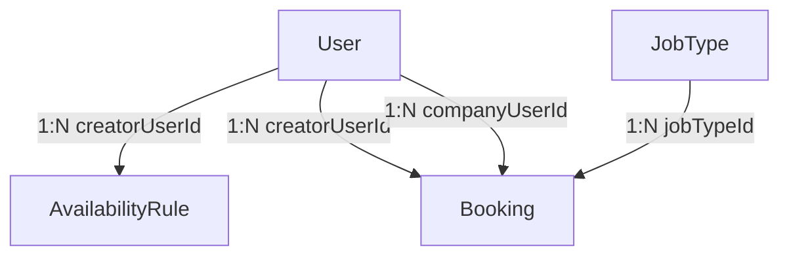
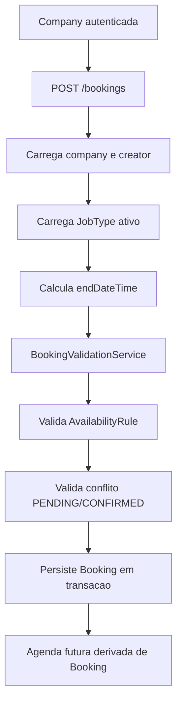

# Arquitetura Final do Nucleo de Agenda e Booking

## Objetivo

Este documento resume como ficou a arquitetura do backend para o MVP de agenda, disponibilidade e booking do marketplace.

O nucleo foi implementado com:

- NestJS
- TypeORM
- PostgreSQL
- migrations explicitas
- separacao por modulos de feature

## Visao Geral da Arquitetura

O backend passou a ter tres modulos principais para o dominio de agenda:

- `availability`
- `job-types`
- `bookings`

Eles se integram com os modulos ja existentes:

- `auth`
- `users`
- `profiles`
- `database`

O desenho final segue o mesmo padrao do restante do projeto:

- `module`
- `controller`
- `service`
- `repository`
- `dto`
- `entities`

## Estrutura dos Modulos

```text
src/
├── availability/
│   ├── dto/
│   │   └── replace-creator-availability.dto.ts
│   ├── entities/
│   │   └── availability-rule.entity.ts
│   ├── availability.controller.ts
│   ├── availability.module.ts
│   ├── availability.repository.ts
│   └── availability.service.ts
│
├── job-types/
│   ├── entities/
│   │   └── job-type.entity.ts
│   ├── job-types.controller.ts
│   ├── job-types.module.ts
│   ├── job-types.repository.ts
│   └── job-types.service.ts
│
├── bookings/
│   ├── dto/
│   │   ├── create-booking.dto.ts
│   │   └── get-creator-calendar.dto.ts
│   ├── entities/
│   │   └── booking.entity.ts
│   ├── services/
│   │   └── booking-validation.service.ts
│   ├── README.md
│   ├── bookings.controller.ts
│   ├── bookings.module.ts
│   ├── bookings.repository.ts
│   └── bookings.service.ts
│
├── common/
│   ├── enums/
│   │   ├── availability-day-of-week.enum.ts
│   │   ├── booking-status.enum.ts
│   │   ├── job-mode.enum.ts
│   │   └── user-role.enum.ts
│   └── utils/
│       └── scheduling-time.util.ts
│
└── database/
    ├── data-source.ts
    ├── database.module.ts
    └── migrations/
        └── 1765400000000-AddSchedulingCore.ts
```

## Responsabilidade de Cada Modulo

### `availability`

Responsavel por manter a disponibilidade semanal recorrente do creator.

Principais responsabilidades:

- ler a disponibilidade atual do creator autenticado
- substituir a semana inteira com `PUT /creator/availability`
- validar payload completo dos 7 dias
- garantir no maximo 1 regra por creator e dia da semana

### `job-types`

Responsavel pelo catalogo de tipos de job.

Principais responsabilidades:

- listar tipos ativos com `GET /job-types`
- servir como fonte de `durationMinutes` e `mode`
- manter os tipos basicos via migration idempotente

No MVP, `POST/PATCH` nao foram expostos publicamente.

### `bookings`

Responsavel pelo fluxo transacional do booking.

Principais responsabilidades:

- criar booking
- validar disponibilidade e conflito
- listar agenda do creator a partir da tabela `bookings`
- aceitar, rejeitar e cancelar bookings
- preservar snapshot minimo do `JobType` usado no momento da criacao

### `BookingValidationService`

Este service concentra a regra de negocio critica do dominio:

- company precisa ter role `COMPANY`
- creator precisa ter role `CREATOR`
- `startDateTime` precisa estar no futuro
- booking precisa caber totalmente dentro de uma `AvailabilityRule`
- booking nao pode cruzar outro dia de disponibilidade
- booking nao pode conflitar com outro `PENDING` ou `CONFIRMED`
- creator nao pode operar booking de outro creator
- somente participantes do booking podem cancelar

Essa centralizacao foi importante para evitar duplicacao entre criacao e transicoes.

## Entidades Implementadas

## `AvailabilityRule` (`availability_rules`)

Regra recorrente semanal por creator e dia da semana.

| Campo | Tipo | Observacao |
|-------|------|------------|
| `id` | uuid | PK |
| `creatorUserId` | uuid | FK para `users.id` |
| `dayOfWeek` | enum | `SUNDAY` a `SATURDAY` |
| `startTime` | time | horario inicial |
| `endTime` | time | horario final |
| `isActive` | boolean | dia ativo ou nao |
| `createdAt` | timestamp | auditoria |
| `updatedAt` | timestamp | auditoria |

Regras importantes:

- unicidade por `creatorUserId + dayOfWeek`
- no MVP existe apenas um intervalo por dia
- alteracao de availability nao invalida bookings futuros existentes

## `JobType` (`job_types`)

Catalogo de tipos de job.

| Campo | Tipo | Observacao |
|-------|------|------------|
| `id` | uuid | PK |
| `name` | varchar(120) | unico |
| `mode` | enum | `PRESENTIAL`, `REMOTE`, `HYBRID` |
| `durationMinutes` | int | duracao fixa do job |
| `isActive` | boolean | filtro de catalogo ativo |
| `createdAt` | timestamp | auditoria |
| `updatedAt` | timestamp | auditoria |

Regras importantes:

- duracao do booking vem daqui
- `mode` do booking e derivado daqui no momento da criacao
- tipos basicos entram via migration idempotente

## `Booking` (`bookings`)

Entidade central da agenda do MVP.

| Campo | Tipo | Observacao |
|-------|------|------------|
| `id` | uuid | PK |
| `companyUserId` | uuid | FK para `users.id` |
| `creatorUserId` | uuid | FK para `users.id` |
| `jobTypeId` | uuid | FK para `job_types.id` |
| `title` | varchar(255) | titulo do booking |
| `description` | text | opcional |
| `mode` | enum | snapshot do modo no momento da criacao |
| `status` | enum | `PENDING`, `CONFIRMED`, `REJECTED`, `CANCELLED`, `COMPLETED` |
| `startDateTime` | timestamptz | inicio real do slot |
| `endDateTime` | timestamptz | fim real calculado |
| `origin` | varchar(100) | origem da solicitacao |
| `notes` | text | opcional |
| `jobTypeNameSnapshot` | varchar(120) | snapshot do nome |
| `durationMinutesSnapshot` | int | snapshot da duracao |
| `createdAt` | timestamp | auditoria |
| `updatedAt` | timestamp | auditoria |

Regras importantes:

- nao existe tabela `CalendarEvent`
- a agenda visual e derivada exclusivamente de `bookings`
- `PENDING` e `CONFIRMED` bloqueiam agenda
- `endDateTime` e calculado automaticamente
- snapshot preserva historico mesmo se `JobType` mudar depois

## Relacionamentos

### Relacoes principais

- `User` 1:N `AvailabilityRule`
- `User` 1:N `Booking` como creator
- `User` 1:N `Booking` como company
- `JobType` 1:N `Booking`

### Diagrama



## Fluxo de Criacao de Booking



## Regras de Negocio Chave

- booking so pode ser criado por `COMPANY`
- booking so pode ser criado para user com role `CREATOR`
- booking precisa estar totalmente dentro da disponibilidade do dia
- booking nao pode conflitar com `PENDING` ou `CONFIRMED`
- conflito usa:

```text
existing.startDateTime < newEndDateTime && existing.endDateTime > newStartDateTime
```

- booking encostado no fim de outro e permitido
- booking cancelado deixa de bloquear slot
- creator aceita `PENDING -> CONFIRMED`
- creator rejeita `PENDING -> REJECTED`
- creator ou company cancelam `PENDING` ou `CONFIRMED`
- `COMPLETED` ficou fora do fluxo publico do MVP

## Estrategia de Consistencia e Concorrencia

O ponto mais critico do dominio ficou em `POST /bookings`.

Medidas implementadas:

- criacao de booking dentro de transacao
- lock pessimista do creator durante a criacao
- lock pessimista ao buscar bookings conflitantes
- lock pessimista ao mudar status de booking

Objetivo:

- reduzir risco de dupla reserva em concorrencia
- garantir consistencia entre validacao e persistencia

## Indices e Constraints

### `availability_rules`

- unique `creator_user_id + day_of_week`
- index `creator_user_id + day_of_week`

### `job_types`

- unique `name`
- index `is_active`

### `bookings`

- index `creator_user_id + start_date_time`
- index `company_user_id + start_date_time`
- index `status`
- index `job_type_id`
- index `creator_user_id + status + start_date_time`
- index parcial para janela bloqueante com `PENDING` e `CONFIRMED`

## Endpoints do MVP

| Metodo | Endpoint | Modulo | Finalidade |
|--------|----------|--------|------------|
| GET | `/creator/availability` | availability | ler disponibilidade do creator |
| PUT | `/creator/availability` | availability | substituir semana inteira |
| GET | `/job-types` | job-types | listar tipos ativos |
| POST | `/bookings` | bookings | criar booking |
| GET | `/creator/calendar?start=...&end=...` | bookings | listar agenda derivada |
| POST | `/bookings/:id/accept` | bookings | creator aceita |
| POST | `/bookings/:id/reject` | bookings | creator rejeita |
| POST | `/bookings/:id/cancel` | bookings | creator/company cancelam |

## Timezone

O dominio foi fechado com timezone unica:

- `America/Sao_Paulo`

Isso vale para:

- validacao de dia da semana
- validacao de janela disponivel
- interpretacao da agenda do MVP

## Testes Implementados

O nucleo recebeu testes automatizados cobrindo:

- criacao valida
- falha por indisponibilidade
- falha por conflito
- aceite
- rejeicao
- cancelamento
- booking cancelado nao bloqueando novo slot
- booking encostado no fim de outro
- bloqueio de actor indevido
- validacao de creator/company

## Limitacoes Atuais do MVP

- apenas um intervalo por dia por creator
- sem excecoes por data especifica
- sem bloqueios manuais fora de booking
- sem multi-timezone
- sem CRUD publico de `JobType`
- sem endpoint publico para `COMPLETED`
- agenda visual ainda depende de transformacao no frontend

## Resumo Executivo

O backend ficou com um nucleo de agenda simples, modular e coerente com o projeto atual:

- `AvailabilityRule` modela disponibilidade recorrente
- `JobType` modela duracao e modo do job
- `Booking` virou a fonte unica da agenda
- `BookingValidationService` centraliza a regra critica
- transacoes e locks reduzem risco de conflito concorrente

Para o MVP, a arquitetura esta enxuta e sustentavel. O proximo passo natural seria evoluir para excecoes por data, multiplos intervalos por dia e fluxos mais completos de operacao de bookings sem quebrar o modelo central atual.
